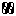

## Calibration cube

image:../.media/thingiverse.png[link="https://www.thingiverse.com/thing:6160577"]
image:../.media/printables.png[link="https://www.printables.com/model/547338"]

image:../.media/grabcad.png[link="https://grabcad.com/library/calibration-cube-20-mm-1"]
image:../.media/thangs.png[link="https://thangs.com/mythangs/file/915103"]
image:../.media/cults.png[link="https://cults3d.com/:1373887"]
image:../.media/myminifactory.png[link="https://mmf.io/o/316676"]
image:../.media/youmagine.png[link="https://www.youmagine.com/designs/calibration-cube-20-mm"]

A simple 20 mm calibration without the "Z" on its top.
